# FastAPI Development Guide

A comprehensive guide for developing APIs with the generated FastAPI + SQLite + Alembic project structure.

## 📊 API Development Flow Diagrams

### High-Level Development Flow


### Developer File Hierarchy & Edit Flow

```mermaid
graph TD
    DEV[Developer starts new API feature] --> REQ[Define API requirements]

    REQ --> MODEL[1. Create Database Model]
    MODEL --> MODEL_FILE[📁 app/models/feature.py]
    MODEL_FILE --> MODEL_CODE["Define Feature class with SQLAlchemy"]

    MODEL --> MIGRATION[2. Generate Migration]
    MIGRATION --> MIGRATION_CMD["💻 alembic revision -m add_feature --autogenerate"]
    MIGRATION_CMD --> MIGRATION_FILE[📁 alembic/versions/xxx_add_feature.py]

    MIGRATION --> APPLY[3. Apply Migration]
    APPLY --> APPLY_CMD["💻 alembic upgrade head"]

    APPLY --> SCHEMA[4. Create Schemas]
    SCHEMA --> SCHEMA_FILE[📁 app/schemas/feature.py]
    SCHEMA_FILE --> SCHEMA_CODE["Create Pydantic models for validation"]

    SCHEMA --> SERVICE[5. Create Service Layer]
    SERVICE --> SERVICE_FILE[📁 app/services/feature_service.py]
    SERVICE_FILE --> SERVICE_CODE["External service integration if needed"]

    SERVICE --> ROUTER[6. Create API Router]
    ROUTER --> ROUTER_FILE[📁 app/api/v1/features.py]
    ROUTER_FILE --> ROUTER_CODE["Define CRUD endpoints"]

    ROUTER --> REGISTER[7. Register Router]
    REGISTER --> MAIN_ROUTER[📁 app/api/routers.py]
    MAIN_ROUTER --> REGISTER_CODE["Import and include router"]

    REGISTER --> TEST[8. Test & Validate]
    TEST --> DOCS["🌐 Visit /docs to test endpoints"]
    DOCS --> MANUAL["🧪 Manual testing"]
    MANUAL --> UNIT["📝 Write unit tests"]

    %% File type styling
    classDef modelFile fill:#ffecb3,stroke:#ff8f00,stroke-width:2px,color:#000
    classDef schemaFile fill:#e1bee7,stroke:#8e24aa,stroke-width:2px,color:#000
    classDef serviceFile fill:#bbdefb,stroke:#1976d2,stroke-width:2px,color:#000
    classDef routerFile fill:#c8e6c9,stroke:#388e3c,stroke-width:2px,color:#000
    classDef configFile fill:#ffcdd2,stroke:#d32f2f,stroke-width:2px,color:#000
    classDef cmdStyle fill:#f5f5f5,stroke:#616161,stroke-width:2px,color:#000

    class MODEL_FILE modelFile
    class SCHEMA_FILE schemaFile
    class SERVICE_FILE serviceFile
    class ROUTER_FILE routerFile
    class MAIN_ROUTER configFile
    class MIGRATION_FILE configFile
    class MIGRATION_CMD cmdStyle
    class APPLY_CMD cmdStyle
```


### Developer Decision Tree


## 🏗️ Project Architecture

### Directory Structure
```
app/
├── __init__.py
├── main.py                 # FastAPI app initialization
├── api/                    # API layer
│   ├── __init__.py
│   ├── routers.py          # Main router aggregator
│   ├── dependencies.py     # Shared dependencies
│   ├── exceptions.py       # Custom exceptions
│   └── v1/                 # API version 1
│       ├── __init__.py
│       ├── auth.py         # Authentication endpoints
│       ├── users.py        # User management
│       ├── permissions.py  # Permission management
│       └── admin.py        # Admin endpoints
├── db/                     # Database layer
│   ├── __init__.py
│   ├── base.py            # SQLAlchemy base
│   └── session.py         # Database session
├── models/                 # SQLAlchemy models
│   ├── __init__.py
│   ├── user.py
│   └── permission.py
├── schemas/                # Pydantic schemas
│   ├── __init__.py
│   ├── user.py
│   ├── permission.py
│   └── common.py          # Shared schemas
├── services/               # External/utility services
│   ├── __init__.py
│   ├── auth_service.py     # Authentication service (JWT, OAuth, etc.)
│   ├── email_service.py    # Email sending service (SMTP, SendGrid, etc.)
│   ├── ocr_service.py      # OCR processing service (Tesseract, cloud APIs)
│   ├── payment_service.py  # Payment processing (Stripe, PayPal, etc.)
│   └── storage_service.py  # File storage service (AWS S3, local, etc.)
└── utils/                  # Utility functions
    ├── __init__.py
    ├── security.py
    └── helpers.py
```

## 🎯 API Development Patterns

### 1. Database Model Development

#### Step 1: Create Model
```python
# app/models/product.py
from sqlalchemy import Column, Integer, String, Float, Boolean, DateTime, ForeignKey
from sqlalchemy.orm import relationship
from sqlalchemy.sql import func
from app.db.base import Base

class Product(Base):
    __tablename__ = "products"

    id = Column(Integer, primary_key=True, index=True)
    name = Column(String, nullable=False, index=True)
    description = Column(String)
    price = Column(Float, nullable=False)
    is_active = Column(Boolean, default=True)
    created_at = Column(DateTime(timezone=True), server_default=func.now())
    updated_at = Column(DateTime(timezone=True), onupdate=func.now())

    # Relationships
    category_id = Column(Integer, ForeignKey("categories.id"))
    category = relationship("Category", back_populates="products")
```

#### Step 2: Import in Alembic
```python
# alembic/env.py
from app.models.user import User, Permission
from app.models.product import Product  # Add new import
```

#### Step 3: Generate and Apply Migration
```bash
alembic revision -m "add product model" --autogenerate
alembic upgrade head
```

### 2. Schema Development

#### Request/Response Schemas
```python
# app/schemas/product.py
from typing import Optional
from datetime import datetime
from pydantic import BaseModel, Field, validator

class ProductBase(BaseModel):
    name: str = Field(..., min_length=1, max_length=100)
    description: Optional[str] = Field(None, max_length=500)
    price: float = Field(..., gt=0, description="Price must be greater than 0")
    is_active: bool = True

class ProductCreate(ProductBase):
    category_id: int

class ProductUpdate(BaseModel):
    name: Optional[str] = Field(None, min_length=1, max_length=100)
    description: Optional[str] = Field(None, max_length=500)
    price: Optional[float] = Field(None, gt=0)
    is_active: Optional[bool] = None
    category_id: Optional[int] = None

class ProductResponse(ProductBase):
    id: int
    created_at: datetime
    updated_at: Optional[datetime] = None
    category_id: int

    class Config:
        from_attributes = True

class ProductListResponse(BaseModel):
    products: list[ProductResponse]
    total: int
    page: int
    size: int
    pages: int
```

#### Validation Patterns
```python
# app/schemas/product.py
class ProductCreate(ProductBase):
    category_id: int

    @validator('price')
    def validate_price(cls, v):
        if v <= 0:
            raise ValueError('Price must be positive')
        if v > 1000000:
            raise ValueError('Price too high')
        return round(v, 2)

    @validator('name')
    def validate_name(cls, v):
        if not v.strip():
            raise ValueError('Name cannot be empty')
        return v.strip().title()
```

### 3. Service Layer Development

#### External Services Layer
```python
# app/services/auth_service.py
import jwt
from datetime import datetime, timedelta
from typing import Optional
from passlib.context import CryptContext
from app.models.user import User

class AuthService:
    def __init__(self, secret_key: str, algorithm: str = "HS256"):
        self.secret_key = secret_key
        self.algorithm = algorithm
        self.pwd_context = CryptContext(schemes=["bcrypt"], deprecated="auto")

    def hash_password(self, password: str) -> str:
        """Hash a password."""
        return self.pwd_context.hash(password)

    def verify_password(self, plain_password: str, hashed_password: str) -> bool:
        """Verify a password against its hash."""
        return self.pwd_context.verify(plain_password, hashed_password)

    def create_access_token(self, user_id: int, expires_delta: Optional[timedelta] = None) -> str:
        """Create JWT access token."""
        if expires_delta:
            expire = datetime.utcnow() + expires_delta
        else:
            expire = datetime.utcnow() + timedelta(minutes=15)

        to_encode = {"sub": str(user_id), "exp": expire}
        return jwt.encode(to_encode, self.secret_key, algorithm=self.algorithm)

    def verify_token(self, token: str) -> Optional[int]:
        """Verify JWT token and return user ID."""
        try:
            payload = jwt.decode(token, self.secret_key, algorithms=[self.algorithm])
            user_id: int = int(payload.get("sub"))
            return user_id
        except jwt.PyJWTError:
            return None


# app/services/email_service.py
import smtplib
from email.mime.text import MIMEText
from email.mime.multipart import MIMEMultipart
from typing import List, Optional

class EmailService:
    def __init__(self, smtp_server: str, smtp_port: int, username: str, password: str):
        self.smtp_server = smtp_server
        self.smtp_port = smtp_port
        self.username = username
        self.password = password

    async def send_email(
        self,
        to_emails: List[str],
        subject: str,
        body: str,
        html_body: Optional[str] = None
    ) -> bool:
        """Send email via SMTP."""
        try:
            msg = MIMEMultipart("alternative")
            msg["Subject"] = subject
            msg["From"] = self.username
            msg["To"] = ", ".join(to_emails)

            # Add text part
            text_part = MIMEText(body, "plain")
            msg.attach(text_part)

            # Add HTML part if provided
            if html_body:
                html_part = MIMEText(html_body, "html")
                msg.attach(html_part)

            # Send email
            with smtplib.SMTP(self.smtp_server, self.smtp_port) as server:
                server.starttls()
                server.login(self.username, self.password)
                server.send_message(msg)

            return True
        except Exception as e:
            print(f"Email sending failed: {e}")
            return False

    async def send_welcome_email(self, user_email: str, username: str) -> bool:
        """Send welcome email to new user."""
        subject = "Welcome to our platform!"
        body = f"Hello {username},\n\nWelcome to our platform!"
        html_body = f"""
        <html>
            <body>
                <h2>Hello {username},</h2>
                <p>Welcome to our platform!</p>
            </body>
        </html>
        """
        return await self.send_email([user_email], subject, body, html_body)


# app/services/ocr_service.py
import pytesseract
from PIL import Image
import io
from typing import Optional

class OCRService:
    def __init__(self, tesseract_path: Optional[str] = None):
        if tesseract_path:
            pytesseract.pytesseract.tesseract_cmd = tesseract_path

    async def extract_text_from_image(self, image_data: bytes) -> str:
        """Extract text from image using Tesseract OCR."""
        try:
            # Open image from bytes
            image = Image.open(io.BytesIO(image_data))

            # Extract text using OCR
            text = pytesseract.image_to_string(image)
            return text.strip()
        except Exception as e:
            print(f"OCR processing failed: {e}")
            return ""

    async def extract_text_from_pdf(self, pdf_data: bytes) -> str:
        """Extract text from PDF using OCR."""
        # Implementation would use pdf2image + tesseract
        pass

    async def detect_language(self, image_data: bytes) -> str:
        """Detect language of text in image."""
        try:
            image = Image.open(io.BytesIO(image_data))
            lang_info = pytesseract.image_to_osd(image)
            # Parse language from OSD output
            return "en"  # Simplified
        except Exception as e:
            print(f"Language detection failed: {e}")
            return "en"


# app/services/storage_service.py
import os
import uuid
from pathlib import Path
from typing import Optional

class StorageService:
    def __init__(self, storage_path: str = "./uploads"):
        self.storage_path = Path(storage_path)
        self.storage_path.mkdir(exist_ok=True)

    async def save_file(self, file_content: bytes, filename: str) -> str:
        """Save file to local storage and return file path."""
        try:
            # Generate unique filename
            file_id = str(uuid.uuid4())
            file_extension = Path(filename).suffix
            unique_filename = f"{file_id}{file_extension}"

            file_path = self.storage_path / unique_filename

            # Save file
            with open(file_path, "wb") as f:
                f.write(file_content)

            return str(file_path)
        except Exception as e:
            print(f"File save failed: {e}")
            raise

    async def get_file(self, file_path: str) -> Optional[bytes]:
        """Retrieve file from storage."""
        try:
            with open(file_path, "rb") as f:
                return f.read()
        except FileNotFoundError:
            return None

    async def delete_file(self, file_path: str) -> bool:
        """Delete file from storage."""
        try:
            os.remove(file_path)
            return True
        except FileNotFoundError:
            return False

    async def get_file_url(self, file_path: str) -> str:
        """Get URL for accessing file (for local storage)."""
        return f"/files/{Path(file_path).name}"
```

### 4. Router Development

#### Complete CRUD Router
```python
# app/api/v1/products.py
from typing import Optional
from fastapi import APIRouter, Depends, HTTPException, status, Query
from sqlalchemy.ext.asyncio import AsyncSession

from app.db.session import get_session
from app.services.product_service import ProductService
from app.schemas.product import (
    ProductResponse,
    ProductCreate,
    ProductUpdate,
    ProductListResponse
)
from app.api.dependencies import get_current_user
from app.api.exceptions import ProductNotFoundError

products_router = APIRouter(prefix="/products", tags=["products"])

async def get_product_service(session: AsyncSession = Depends(get_session)) -> ProductService:
    """Dependency to get product service."""
    return ProductService(session)

@products_router.get("/", response_model=ProductListResponse)
async def get_products(
    skip: int = Query(0, ge=0, description="Number of products to skip"),
    limit: int = Query(100, ge=1, le=1000, description="Number of products to return"),
    category_id: Optional[int] = Query(None, description="Filter by category ID"),
    active_only: bool = Query(True, description="Show only active products"),
    service: ProductService = Depends(get_product_service)
):
    """Get products with filtering and pagination."""
    products = await service.get_products(
        skip=skip,
        limit=limit,
        category_id=category_id,
        active_only=active_only
    )

    # Get total count for pagination
    total = len(products)  # Simplified - in production, do a separate count query
    pages = (total + limit - 1) // limit

    return ProductListResponse(
        products=products,
        total=total,
        page=(skip // limit) + 1,
        size=limit,
        pages=pages
    )

@products_router.get("/{product_id}", response_model=ProductResponse)
async def get_product(
    product_id: int,
    service: ProductService = Depends(get_product_service)
):
    """Get product by ID."""
    product = await service.get_product(product_id)
    if not product:
        raise HTTPException(
            status_code=status.HTTP_404_NOT_FOUND,
            detail=f"Product with id {product_id} not found"
        )
    return product

@products_router.post("/", response_model=ProductResponse, status_code=status.HTTP_201_CREATED)
async def create_product(
    product_data: ProductCreate,
    service: ProductService = Depends(get_product_service),
    current_user = Depends(get_current_user)  # Require authentication
):
    """Create new product."""
    try:
        product = await service.create_product(product_data)
        return product
    except Exception as e:
        raise HTTPException(
            status_code=status.HTTP_400_BAD_REQUEST,
            detail=str(e)
        )

@products_router.put("/{product_id}", response_model=ProductResponse)
async def update_product(
    product_id: int,
    product_data: ProductUpdate,
    service: ProductService = Depends(get_product_service),
    current_user = Depends(get_current_user)
):
    """Update product."""
    try:
        product = await service.update_product(product_id, product_data)
        return product
    except ProductNotFoundError:
        raise HTTPException(
            status_code=status.HTTP_404_NOT_FOUND,
            detail=f"Product with id {product_id} not found"
        )
    except Exception as e:
        raise HTTPException(
            status_code=status.HTTP_400_BAD_REQUEST,
            detail=str(e)
        )

@products_router.delete("/{product_id}", status_code=status.HTTP_204_NO_CONTENT)
async def delete_product(
    product_id: int,
    service: ProductService = Depends(get_product_service),
    current_user = Depends(get_current_user)
):
    """Delete product (soft delete)."""
    try:
        await service.delete_product(product_id)
    except ProductNotFoundError:
        raise HTTPException(
            status_code=status.HTTP_404_NOT_FOUND,
            detail=f"Product with id {product_id} not found"
        )
```

### 5. Dependency Management

#### Common Dependencies
```python
# app/api/dependencies.py
from typing import Optional
from fastapi import Depends, HTTPException, status, Header
from sqlalchemy.ext.asyncio import AsyncSession
from jose import JWTError, jwt

from app.db.session import get_session
from app.models.user import User
from app.services.auth_service import AuthService

async def get_auth_service(session: AsyncSession = Depends(get_session)) -> AuthService:
    return AuthService(session)

async def get_current_user(
    authorization: Optional[str] = Header(None),
    auth_service: AuthService = Depends(get_auth_service)
) -> User:
    """Get current authenticated user."""
    if not authorization or not authorization.startswith("Bearer "):
        raise HTTPException(
            status_code=status.HTTP_401_UNAUTHORIZED,
            detail="Missing or invalid authentication token",
            headers={"WWW-Authenticate": "Bearer"},
        )

    token = authorization.split(" ")[1]
    try:
        user = await auth_service.get_user_from_token(token)
        if not user:
            raise HTTPException(
                status_code=status.HTTP_401_UNAUTHORIZED,
                detail="Invalid authentication credentials",
                headers={"WWW-Authenticate": "Bearer"},
            )
        return user
    except JWTError:
        raise HTTPException(
            status_code=status.HTTP_401_UNAUTHORIZED,
            detail="Invalid authentication credentials",
            headers={"WWW-Authenticate": "Bearer"},
        )

async def get_admin_user(current_user: User = Depends(get_current_user)) -> User:
    """Require admin permissions."""
    if not current_user.is_admin:
        raise HTTPException(
            status_code=status.HTTP_403_FORBIDDEN,
            detail="Admin privileges required"
        )
    return current_user

def require_permissions(*required_permissions: str):
    """Decorator factory for permission-based access control."""
    def permission_dependency(current_user: User = Depends(get_current_user)) -> User:
        user_permissions = {p.name for p in current_user.permissions}
        if not any(perm in user_permissions for perm in required_permissions):
            raise HTTPException(
                status_code=status.HTTP_403_FORBIDDEN,
                detail=f"Required permissions: {', '.join(required_permissions)}"
            )
        return current_user
    return permission_dependency

# Usage examples:
# @router.get("/admin-only")
# async def admin_endpoint(admin_user: User = Depends(get_admin_user)):
#     pass
#
# @router.post("/create-product")
# async def create_product(user: User = Depends(require_permissions("create_product", "admin"))):
#     pass
```

### 6. Error Handling

#### Custom Exceptions
```python
# app/api/exceptions.py
from fastapi import HTTPException, status

class BaseAPIException(HTTPException):
    """Base exception for API errors."""
    def __init__(self, detail: str, status_code: int = status.HTTP_400_BAD_REQUEST):
        super().__init__(status_code=status_code, detail=detail)

class NotFoundError(BaseAPIException):
    """Generic not found error."""
    def __init__(self, resource: str, resource_id: int):
        super().__init__(
            detail=f"{resource} with id {resource_id} not found",
            status_code=status.HTTP_404_NOT_FOUND
        )

class ProductNotFoundError(NotFoundError):
    def __init__(self, product_id: int):
        super().__init__("Product", product_id)

class CategoryNotFoundError(NotFoundError):
    def __init__(self, category_id: int):
        super().__init__("Category", category_id)

class DuplicateResourceError(BaseAPIException):
    def __init__(self, resource: str, field: str, value: str):
        super().__init__(
            detail=f"{resource} with {field} '{value}' already exists",
            status_code=status.HTTP_409_CONFLICT
        )

class ValidationError(BaseAPIException):
    def __init__(self, field: str, message: str):
        super().__init__(
            detail=f"Validation error for {field}: {message}",
            status_code=status.HTTP_422_UNPROCESSABLE_ENTITY
        )

class PermissionDeniedError(BaseAPIException):
    def __init__(self, action: str, resource: str):
        super().__init__(
            detail=f"Permission denied: cannot {action} {resource}",
            status_code=status.HTTP_403_FORBIDDEN
        )
```

#### Global Exception Handler
```python
# app/main.py
from fastapi import FastAPI, Request
from fastapi.responses import JSONResponse
from sqlalchemy.exc import IntegrityError
from app.api.exceptions import BaseAPIException

app = FastAPI()

@app.exception_handler(BaseAPIException)
async def api_exception_handler(request: Request, exc: BaseAPIException):
    return JSONResponse(
        status_code=exc.status_code,
        content={"detail": exc.detail, "type": "api_error"}
    )

@app.exception_handler(IntegrityError)
async def integrity_error_handler(request: Request, exc: IntegrityError):
    return JSONResponse(
        status_code=400,
        content={"detail": "Database integrity error", "type": "database_error"}
    )

@app.exception_handler(500)
async def internal_error_handler(request: Request, exc: Exception):
    return JSONResponse(
        status_code=500,
        content={"detail": "Internal server error", "type": "internal_error"}
    )
```

### 7. Router Registration

#### Main Router Setup
```python
# app/api/routers.py
from fastapi import APIRouter
from app.api.v1.auth import auth_router
from app.api.v1.users import users_router
from app.api.v1.products import products_router
from app.api.v1.categories import categories_router
from app.api.v1.admin import admin_router

api_router = APIRouter()

# Public routes
api_router.include_router(auth_router)

# Protected routes
api_router.include_router(users_router)
api_router.include_router(products_router)
api_router.include_router(categories_router)

# Admin routes
api_router.include_router(admin_router, prefix="/admin")
```

#### Main App Integration
```python
# app/main.py
from fastapi import FastAPI
from fastapi.middleware.cors import CORSMiddleware
from app.api.routers import api_router

app = FastAPI(
    title="Product Management API",
    description="FastAPI application for product management",
    version="1.0.0",
    docs_url="/docs",
    redoc_url="/redoc"
)

# Middleware
app.add_middleware(
    CORSMiddleware,
    allow_origins=["http://localhost:3000"],
    allow_credentials=True,
    allow_methods=["*"],
    allow_headers=["*"],
)

# Include routers
app.include_router(api_router, prefix="/api/v1")

@app.get("/")
async def root():
    return {"message": "Product Management API"}

@app.get("/health")
async def health_check():
    return {"status": "healthy"}
```

## 🧪 Testing Patterns

### Unit Testing
```python
# tests/test_product_service.py
import pytest
from sqlalchemy.ext.asyncio import AsyncSession
from app.services.product_service import ProductService
from app.schemas.product import ProductCreate
from app.models.product import Product

@pytest.mark.asyncio
async def test_create_product(async_session: AsyncSession):
    service = ProductService(async_session)
    product_data = ProductCreate(
        name="Test Product",
        description="Test Description",
        price=99.99,
        category_id=1
    )

    product = await service.create_product(product_data)

    assert product.id is not None
    assert product.name == "Test Product"
    assert product.price == 99.99
```

### Integration Testing
```python
# tests/test_products_api.py
import pytest
from httpx import AsyncClient
from app.main import app

@pytest.mark.asyncio
async def test_get_products():
    async with AsyncClient(app=app, base_url="http://test") as client:
        response = await client.get("/api/v1/products/")

    assert response.status_code == 200
    data = response.json()
    assert "products" in data
    assert "total" in data
```

## 📚 Best Practices

### 1. Code Organization
- ✅ Separate concerns (models, schemas, services, routers)
- ✅ Use dependency injection
- ✅ Implement proper error handling
- ✅ Follow RESTful conventions

### 2. Security
- ✅ Validate all inputs
- ✅ Use proper authentication/authorization
- ✅ Sanitize database queries
- ✅ Implement rate limiting

### 3. Performance
- ✅ Use async/await properly
- ✅ Optimize database queries
- ✅ Implement caching where appropriate
- ✅ Use pagination for large datasets

### 4. Documentation
- ✅ Write clear docstrings
- ✅ Use Pydantic for automatic schema documentation
- ✅ Provide examples in API docs
- ✅ Keep README updated

## 🔗 Related Files

- [CREATE_PROJECT_README.md](./CREATE_PROJECT_README.md) - Main project generator documentation
- [Backend README](./backend/README.md) - Current project documentation
- Generated project READMEs - Project-specific documentation
